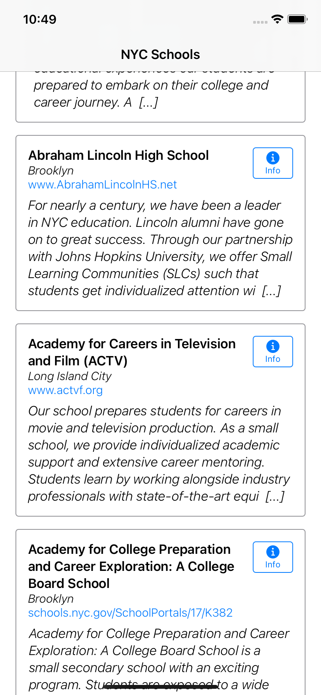
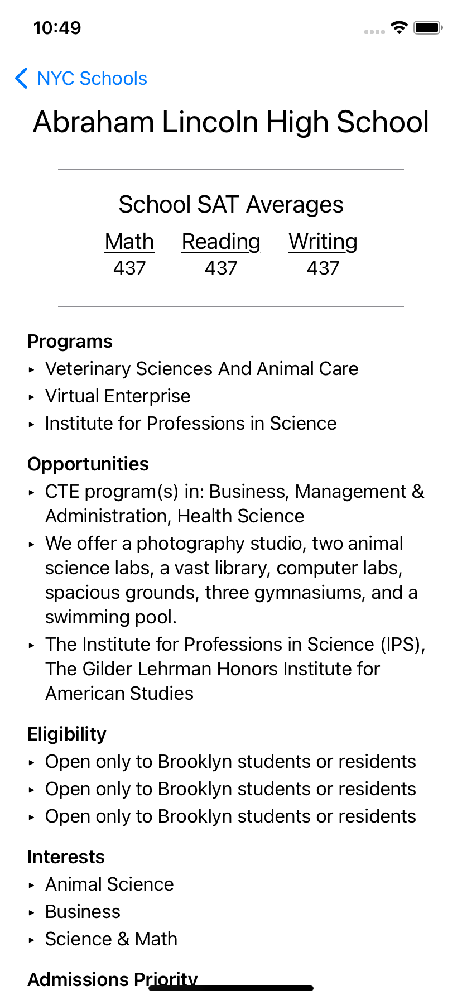
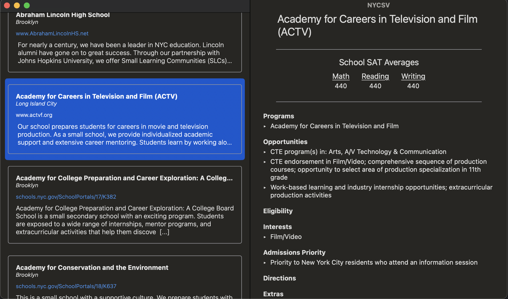

# NYCS
SwiftUI Sample App targeting NYC Schools Open APIs

# Some requirements:

* Display a list of NYC High Schools.
* Selecting a school should show additional information about the school
** Display all the SAT scores - include Math, Reading and Writing.

# API Links

* School list:  https://data.cityofnewyork.us/Education/2017-DOE-High-School-Directory/s3k6-pzi2
* Results: https://data.cityofnewyork.us/Education/SAT-Results/f9bf-2cp4

